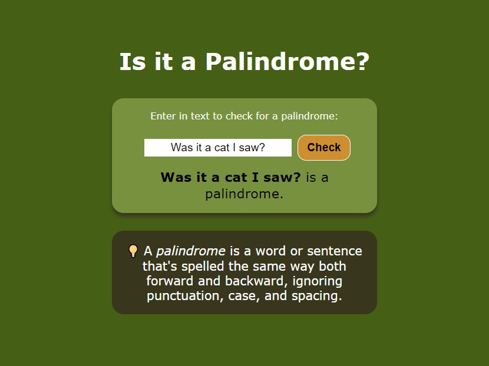

# palindrome-checker
freeCodeCamp JavaScript Algorithms and Data Structures Certification Project
 Palindrome Checker
 An application that checks whether a given word is palindrome

Browse: <https://cemcelikgh.github.io/palindrome-checker/>

