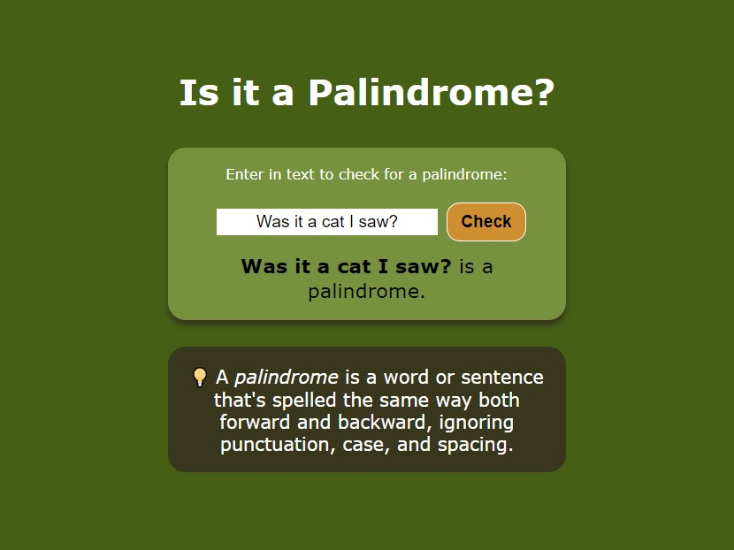

# palindrome-checker
freeCodeCamp JavaScript Algorithms and Data Structures Certification Project
 Palindrome Checker
 An application that checks whether a given word is palindrome

Browse: <https://is-it-a-palindrome.netlify.app/>

